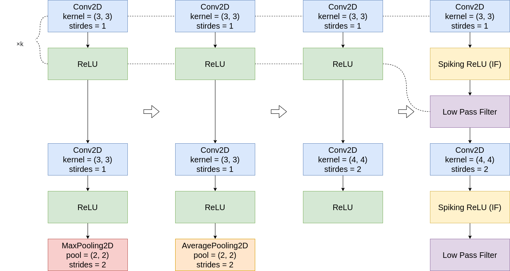
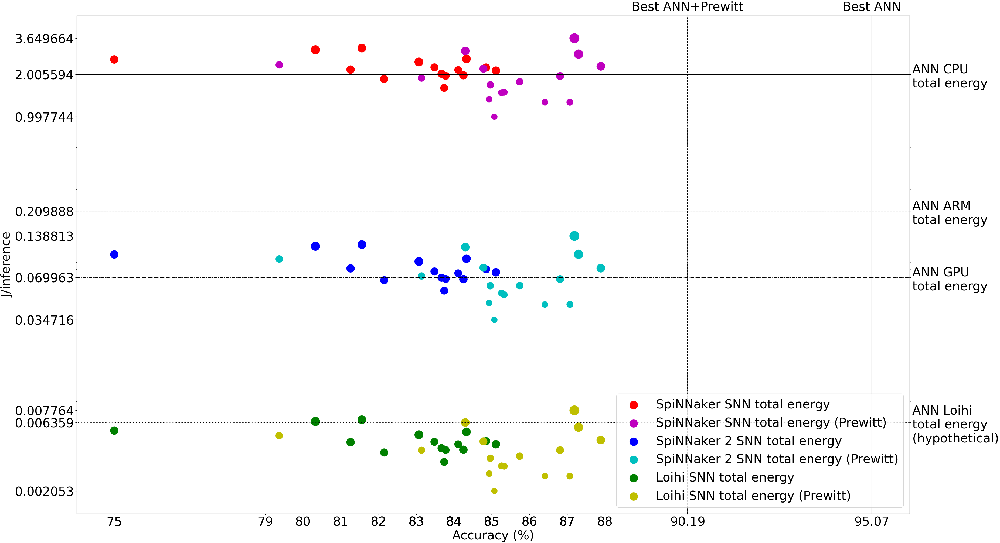

# SNN for Space

## Table of contents

* [About this project](#about-this-project)
* [Requirements](#requirements)
* [Installation](#installation)
* [Usage](#usage)
    * [Training a VGG16-based model on EuroSAT RGB and UC Merced datasets](#training-a-vgg16-based-model-on-eurosat-rgb-and-uc-merced-datasets)
    * [Training a spiking model](#training-a-spiking-model)
    * [Energy consumption estimation](#energy-consumption-estimation)
* [License](#license)
* [Contributors](#contributors)
* [Contact](#contact)
* [Acknowledgements](#acknowledgements)

## About this project

This project investigates the feasibility of deploying spiking neural networks (SNN) in land cover and land use 
classification tasks. In particular, a [VGG-16](https://neurohive.io/en/popular-networks/vgg16/) -based artificial 
neural network (ANN) classifier is converted into an SNN using [KerasSpiking](https://www.nengo.ai/keras-spiking/). 
After fine-tuning of the converted model, we compare the accuracy depreciation as well as a potential improvement in 
the energy consumption on selected hardware platforms.

## Requirements

This project uses [Python](https://www.python.org/) 3.10, and requires the following third-party libraries:

* [KerasSpiking](https://www.nengo.ai/keras-spiking/) 0.3.0
* [NumPy](https://numpy.org/) 1.19.5
* [TensorBoard](https://www.tensorflow.org/tensorboard/) 2.8.0
* [TensorFlow](https://www.tensorflow.org/) 2.6.0
* [TensorFlow Datasets](https://www.tensorflow.org/datasets) 4.5.0
* [Tensorflow I/O](https://www.tensorflow.org/io) 0.21.0

No issues related to using different versions of the other libraries was encountered. Nonetheless, recommend 
creating a separate environment for this project and installing the versions of the packages specified above.
[NumPy](https://numpy.org/) can be acquired by installing the [Anaconda](https://www.anaconda.com/) distribution of 
[Python](https://www.python.org/).

Alternatively, all the required libraries can be installed using `pip`:

```shell
pip install numpy==1.19.5 tensorflow==2.6.0 tensorflow-io==0.21.0 tensorflow-datasets==4.5.0 keras-spiking==0.3.0
```

In case there are issues with running the [TensorFlow](https://www.tensorflow.org/) files on a GPU-equipped 
workstation, we recommend trying [TensorFlow](https://www.tensorflow.org/) nightly:

```shell
pip install tf-nightly tensorflow-nightly-io
```

## Installation

To install this project either download it as a `.zip` file and extract it into a desired directory or clone it via 
the terminal or console command:

* using the HTTPS

```shell
git clone https://github.com/AndrzejKucik/SNN4Space.git
```

* or SSH

```shell
git clone git@github.com:AndrzejKucik/SNN4Space.git
```

## Usage

Change the current working directory to be the `SNN4Space`directory.

### Training a VGG16-based model on EuroSAT RGB and UC Merced datasets

In the first part of the project we download either the [EuroSAT: Land Use and Land Cover Classification with Sentinel-2
Dataset](https://github.com/phelber/EuroSAT) (10 classes, 27000 examples) or the
[UC Merced Land Use Dataset](http://weegee.vision.ucmerced.edu/datasets/landuse.html) (21 classes, 100 examples each)
. We slice it into the training, validation, and test sets using ratios 80%-10%-10%
(the[UC Merced](http://weegee.vision.ucmerced.edu/datasets/landuse.html) data examples are ordered according to version
[2.0.0](https://www.tensorflow.org/datasets/catalog/uc_merced) in 
[TensorFlow Datasets](https://www.tensorflow.org/datasets) ). We augment the training set using random dihedral 
group transformation, random crop, random brightness change, random contrast change, random hue change, random 
saturation change. We use a modified version of the [VGG-16](https://neurohive.io/en/popular-networks/vgg16/) 
network trained on the [ImageNet](http://www.image-net.org/) dataset (parameters from the 
[Keras-TensorFlow](https://www.tensorflow.org/api_docs/python/tf/keras/applications/VGG16)) version to construct a 
classifier for this dataset. We replace the max pooling layers with average pooling layers, we remove the head of 
the network (all the layers following the last pooling layers) and replace it with a global pooling layer, and a 
dense classifier without bias. We resize the [UC Merced](http://weegee.vision.ucmerced.edu/datasets/landuse.html) images
to (224, 224, 3) shape (to be compatible with the usual [VGG-16](https://neurohive.io/en/popular-networks/vgg16/) 
input size). The model is trained using the RMSprop optimizer, using early stopping and reducing the learning rate 
on a plateau (by a factor of 10) if there is no significant improvement in the validation loss after 100 and 50 
consecutive epochs respectively. Optionally, L<sub>2</sub> and L<sub>1</sub> regularization is applied to 
convolutional kernels and biases, respectively.

To train the network run:

```shell
python train_models.py [-ds dataset] [-s seed] [-e epochs] [-bs batch_size] [-drpt dropout] [-kl2 kernel_regularizer]
 [-bl1 bias_regularizer] [-lz lower_zoom] [-uz upper_zoom] [-mbd max_brightness_delta] [-mhd max_hue_delta] [-lc 
 lower_contrast] [-uc upper_contrast] [-ls lower_saturation] [-us upper_saturation]
```

where the optional arguments are:

* `dataset` - chosen dataset; either `eurosat`, or `ucm`; one can also add either `prewitt` or `sobel`, then the 
  (normalised) Prewitt or Sobel transforms are applied to the input images, and also, optionally `mask`, then the 
  original images with those pixels, for which the Prewitt or Sobel transform are zero, masked out are used as the
  input; if `sq` is added, then the transforms are squared (or, equivalently, the square root in the Prewitt or 
  Sobel transforms is not applied); so for example it can be `eurosat_prewitt_sq_mask` ot `ucm_sobel` etc.
* `seed` - global random seed,
* `epochs` - number of training epochs,
* `batch_size` - training batch size (per a replica),
* `learning_rate`- learning rate,
* `kernel_l2` - regularization L<sub>2</sub> parameter for the convolutional kernels,
* `bias_l1` - regularization L<sub>1</sub> parameter for the convolutional biases,
* `lower_zoom` - augmentation parameter; lower bound for a random zoom factor; must be positive,
* `upper_zoom` - augmentation parameter; upper bound for a random zoom factor; must be bigger than `lower_zoom`.
* `max_brightness_delta` - augmentation parameter; maximum brightness delta; must be a non-negative float,
* `max_hue_delta` - augmentation parameter; maximum hue delta; must be in the interval \[0, 0.5\],
* `lower_contrast` - augmentation parameter; lower bound for a random contrast factor; must be positive,
* `upper_contrast` - augmentation parameter; upper bound for a random contrast factor must be bigger than 
  `lower_contrast`,
* `lower_saturation` - augmentation parameter; lower bound for a random saturation factor; must be positive,
* `upper_saturation` - augmentation parameter; upper bound for a random saturation factor; must be bigger than 
  `lower_saturation`.

The default values of these parameters (apart from the batch size) are the ones that empirically gave us the best 
test accuracy performance (91.43%) on [UC Merced](http://weegee.vision.ucmerced.edu/datasets/landuse.html) and (95.
07%) on [EuroSat](https://github.com/phelber/EuroSAT).

**_Note that the obtained test set accuracy might be different each time (sometimes even failing to converge), even 
if identical parameters are used, because the global random seed does not seem to affect the shuffling processes or 
data augmentation parameters._**

### Training a spiking model

A [VGG-16](https://neurohive.io/en/popular-networks/vgg16/) -based classifier
trained on the [EuroSat](https://github.com/phelber/EuroSAT)
or [UC Merced](http://weegee.vision.ucmerced.edu/datasets/landuse.html)
datasets can be converted into a spiking neural network and trained
using [KerasSpiking](https://www.nengo.ai/keras-spiking/) module by running

```shell
python train_spiking_models.py -md model_path -ds dataset [-s seed] \
[-i iterate] [-e epochs] [-bs batch_size] [-lr learning_rate] [-t timesteps] \
[-dt dt] [-l2 l2] [-lhz lower_hz] [-uhz upper_hz] [-tau tau] [-lz lower_zoom] \
[-uz upper_zoom] [-mbd max_brightness_delta] [-mhd max_hue_delta] \
[-lc lower_contrast] [-uc upper_contrast] [-ls lower_saturation] \ 
[-us upper_saturation]
```

where

* `model_path` - path of a valid `.h5` model which we obtain after running `train_models.py`,
* `iterate` - boolean determining whether the training should be performed iteratively, doubling the number of 
  timesteps, and halving the batch size, the number of epochs, and the learning rate at each iteration,
* `timesteps` - number of the simulation timesteps,
* `dt` - temporal resolution of timesteps; it is decreased during the training until it reaches the value of 1 ms
* `l2` - weight penalty for L<sub>2</sub> activity regularization of the spikes,
* `lower_hz` - lower frequency threshold for spiking rate regularization,
* `upper_hz` - upper frequency threshold for spiking rate regularization,
*  `tau` - tau parameter for the low-pass filter.

The rest of the options are as defined the in the 
[previous subsection](#training-a-vgg16-based-model-on-eurosat-rgb-and-uc-merced-datasets) above, however, `epochs`, 
`batch_size`, and `learning_rate` are always the starting values if the training is done iteratively, and 
`timesteps` is the approximate number of target simulation timesteps (the actual number of timesteps is always a 
power of 2), while the starting number of timesteps is 1.

Before the training, the local average pooling layers are removed, and the preceding convolutions have their strides 
set to 2, and their weights appropriately adjusted for consistency. The ReLU activation functions are swapped with
[spiking activations](https://www.nengo.ai/keras-spiking/reference.html?highlight=spiking#keras_spiking.SpikingActivation)
followed by
a [low-pass filter](https://www.nengo.ai/keras-spiking/reference.html?highlight=spiking#keras_spiking.Lowpass)



The trained spiking model can be fine-tuned for a specific number of time steps and *fixed* temporal dimension by 
running:

```shell
python fine_tune_snn.py -wp weights_path -ds dataset [-s seed] [-e epochs] \
[-bs batch_size] [-lr learning_rate] [-t timesteps] [-dt dt] [-l2 l2] \
[-lhz lower_hz] [-uhz upper_hz] [-tau tau] [-lz lower_zoom] [-uz upper_zoom] \
[-mbd max_brightness_delta] [-mhd max_hue_delta] [-lc lower_contrast] \
[-uc upper_contrast] [-ls lower_saturation] [-us upper_saturation]
```

where `weights_path` is a path to a valid `.h5` file with pre-trained weights (as output by `train_spiking_models. 
py`), and the rest of the parameters are as above.


### Energy consumption estimation

To compare the estimated energy consumption of the ANN and SNN (both with local pooling layers replaced by 
doubly-strided convolutions) on representative hardware (standard and neuromorphic), run:

```shell
python energy_estimation.py -wp weights_path -ds dataset -bs batch_size \
-t timesteps -dt dt -v verbose
```

where `verbose` is the verbosity mode, and the remaining options are as in the [previous section]
(#training-a-spiking-model).



## License

Property of the [European Space Agency](https://www.esa.int/). Distributed under MIT licence. See [`LICENSE`](./LICENSE)
for more information.

## Contributors

* [Andrzej Kucik](https://github.com/AndrzejKucik/)
* [Gabriele Meoni](https://github.com/GabrieleMeoni/)

## Contact

E-mail: [andrzej.kucik@esa.int](mailto:andrzej.kucik@esa.int) [gabriele.meoni@esa.int](mailto:gabriele.meoni@esa.int)

Project Link: <https://github.com/AndrzejKucik/SNN4Space>

## Acknowledgements

* [ESA Advanced Concepts Team](https://github.com/esa)
* [ESA &Phi;-Lab](https://github.com/ESA-PhiLab)
