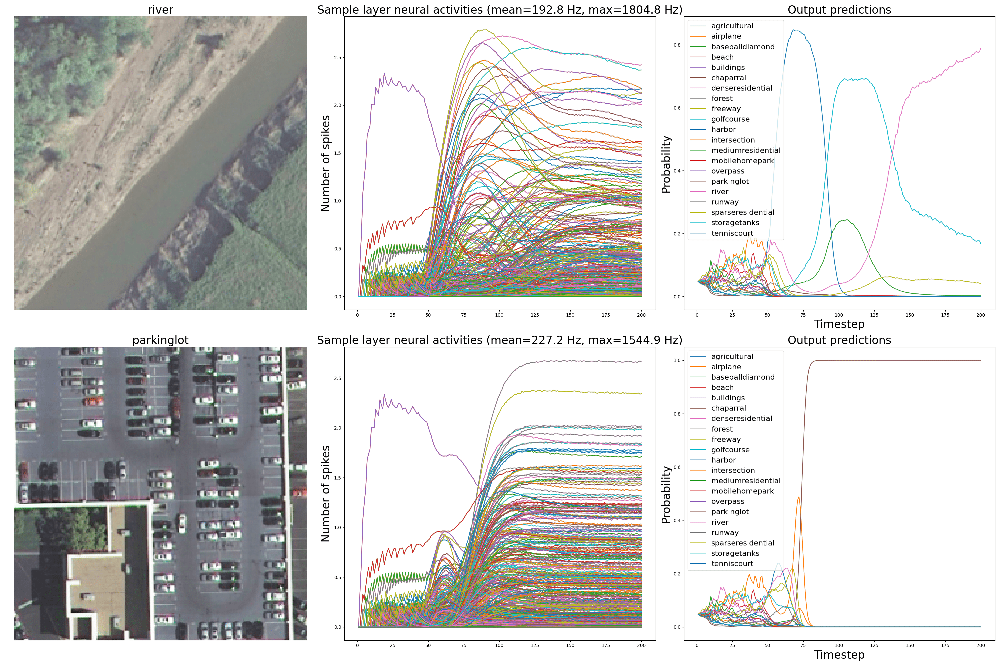
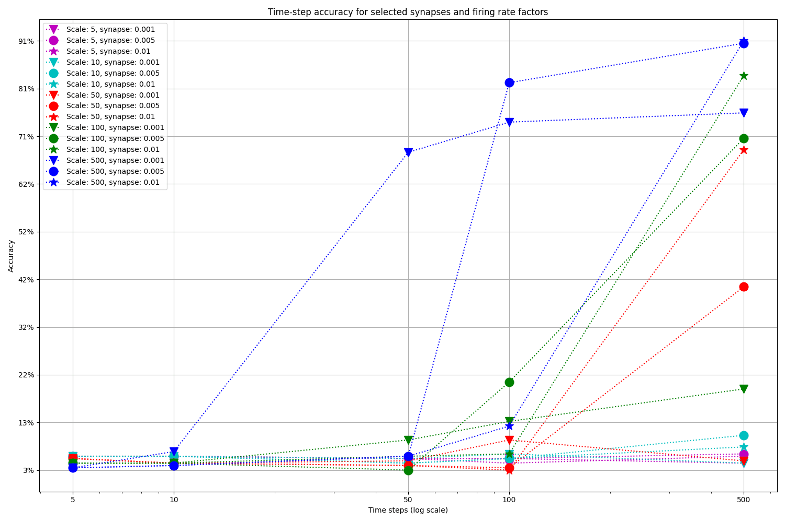

# Nengo Space

## Table of contents

* [About this project](#about-this-project)
* [Requirements](#requirements)
* [Installation](#installation)
* [Usage](#usage)
    * [Testing](#testing)
    * [Training a VGG16-based model on EuroSAT and UC Merced datasets](#training-a-vgg16-based-model-on-eurosat-and-uc-merced-datasets)
    * [Converting to a spiking neural network](#converting-to-a-spiking-neural-network)
    * [Energy consumption estimation](#energy-consumption-estimation)
* [Roadmap](#roadmap)
* [License](#license)
* [Contributors](#contributors)
* [Contact](#contact)
* [Acknowledgements](#acknowledgements)

## About this project

This projects aims at testing the feasibility of using  [Nengo](https://www.nengo.ai/nengo/)-based spiking neural
networks on Earth observation data, as well as other space-related applications.

In particular, the current implementation converts a [VGG-16](https://neurohive.io/en/popular-networks/vgg16/)-based
classifier, trained
on [EuroSAT: Land Use and Land Cover Classification with Sentinel-2 Dataset](https://github.com/phelber/EuroSAT) and
[UC Merced Land Use Dataset](http://weegee.vision.ucmerced.edu/datasets/landuse.html), into
a [Nengo](https://www.nengo.ai/nengo/)-based
spiking neural network, and evaluates it on the same dataset.

## Requirements

This project uses [Python](https://www.python.org/) 3.6, and requires the following third party libraries:

* [NumPy](https://numpy.org/) 1.19.5
* [Matplotlib](https://matplotlib.org/) 3.3.3
* [TensorFlow](https://www.tensorflow.org/) 2.4.1
* [TensorFlow Datasets](https://www.tensorflow.org/datasets) 4.1.0
* [Tensorflow I/O](https://www.tensorflow.org/io) 0.17.0
* [Nengo](https://www.nengo.ai/nengo/) 3.1.0
* [NengoDL](https://www.nengo.ai/nengo-dl/) 3.4.0

Different versions of Nengo packages will raise assertion errors. This is because there are compatibility issues between
newer versions of [Nengo](https://www.nengo.ai/nengo/) and the current [NengoDL](https://www.nengo.ai/nengo-dl/) (at the
time or writing this). No issues related to using different versions of the other libraries was encountered.
Nonetheless, recommend creating a separate environment for this project and installing the versions of the packages
specified above. [NumPy](https://numpy.org/) can be acquired by installing the
[Anaconda](https://www.anaconda.com/) distribution of [Python](https://www.python.org/).

Alternatively, all the required libraries can be installed using `pip`:

```pip install numpy==1.19.5 matplotlib==3.3.3 tensorflow==2.4.1 tensorflow-io==0.17.0 tensorflow-datasets==4.1.0 nengo==3.1.0 nengo-dl==3.4.0```

## Installation

To install this project either download it as a `.zip` file and extract it into a desired directory or clone it via the
terminal or console command:

* using the HTTPS

```git clone https://github.com/AndrzejKucik/Nengo_Space.git```

* or SSH

```git clone git@github.com:AndrzejKucik/Nengo_Space.git```

## Usage

Change the current working directory to be the `Nengo_Space`directory.

### Testing

To test that the training of a [Keras](https://keras.io/)-based model and conversion to
a [Nengo](https://www.nengo.ai/nengo/)-based
spiking neural network works well, run:

```python nengo_test.py```

This will create a simple classifier model with two convolutional hidden layers, and a single dense output layer. The
layers do not use bias parameters (for biological plausibility). This model is then trained for five epochs on the
[MNIST dataset](http://yann.lecun.com/exdb/mnist/) with RMSprop optimizer and L<sub>2</sub> regularization for the
convolutional kernels. After the training and testing (it should achieve roughly 99% test set accuracy), the model is
converted into a spiking neural network using [NengoDL](https://www.nengo.ai/nengo-dl/) library. This network is then
tested in the spiking setting, using 0.01 synapse and scaling the firing rate by 100. It should achieve comparable test
set performance in this setting. See the code for details.

### Training a VGG16-based model on EuroSAT and UC Merced datasets

In the first part of the project we download either
the [EuroSAT: Land Use and Land Cover Classification with Sentinel-2 Dataset](https://github.com/phelber/EuroSAT)
(10 classes, 27000 examples) or
the [UC Merced Land Use Dataset](http://weegee.vision.ucmerced.edu/datasets/landuse.html)
(21 classes, 100 examples each). We slice it into the training, validation, and test sets using ratios 80%-10%-10% (the
[UC Merced](http://weegee.vision.ucmerced.edu/datasets/landuse.html) data examples are ordered according to version
[2.0.0](https://www.tensorflow.org/datasets/catalog/uc_merced) in TensorFlow datasets). We augment the training set
using random dihedral group transformation, random crop, random brightness change, random contrast change, random hue
change, random saturation change. We use a modified version of
the [VGG-16](https://neurohive.io/en/popular-networks/vgg16/)
network trained on the [ImageNet](http://www.image-net.org/) dataset (parameters from the
[Keras-TensorFlow](https://www.tensorflow.org/api_docs/python/tf/keras/applications/VGG16)) version to construct a
classifier for this dataset. We replace the max pooling layers with average pooling layers in order to have a spiking
neural network compatibility in [NengoDL](https://www.nengo.ai/nengo-dl/). We remove the head of the network (all the
layers following the last pooling layers) and replace it with a dense classifier layer. The final pooling layer before
the classifier is a global, rather than local, average pooling layer. Optionally, one can add a dropout layer after each
local average pooling layer. We resize the [UC Merced](http://weegee.vision.ucmerced.edu/datasets/landuse.html) images
to (224, 224, 3) shape (To be compatible with the usual [VGG-16](https://neurohive.io/en/popular-networks/vgg16/) input
size). The model is trained using the RMSprop optimizer, using early stopping and reducing the learning rate on a
plateau (by a factor of 10) if there is no significant improvement in the validation loss after 100 and 50 consecutive
epochs respectively.

To train the network run:

```
python train_models.py [-ds dataset] [-s seed] [-e epochs] [-bs batch_size] [-drpt dropout] [-kl2 kernel_l2] [-bl1 bias_l1] [-lz lower_zoom] [-uz upper_zoom] [-mbd max_brightness_delta] [-mhd max_hue_delta] [-lc lower_contrast] [-uc upper_contrast] [-ls lower_saturation] [-us upper_saturation]
```

where the optional arguments are:

* `dataset` - chosen dataset; either `eurosat`, or `ucm`; one can also add either `prewitt` or `sobel`, then the
  (normalised) Prewitt or Sobel transforms are applied to the input images, and also, optionally `mask`, then the
  original images with those pixels, for which the Prewitt or Sobel transform are zero, masked out are used as the
  input; if `sq` is added, then the transforms are squared (or, equivalently, the square root in the Prewitt or Sobel
  transforms is not applied); so for example it can be `eurosat_prewitt_sq_mask` ot `ucm_sobel` etc.
* `seed` - global random seed,
* `epochs` - number of training epochs,
* `batch_size` - training batch size (per a replica),
* `dropout` - dropout factor; ust be in \[0, 1),
* `kernel_l2` - regularization L<sub>2</sub> parameter for the convolutional kernels,
* `bl1 bias_l1` - regularization L<sub>1</sub> parameter for the convolutional biases,
* `lower_zoom` - augmentation parameter; lower bound for a random zoom factor; must be positive,
* `upper_zoom` - augmentation parameter; upper bound for a random zoom factor; must be bigger than `lower_zoom`.
* `max_brightness_delta` - augmentation parameter; maximum brightness delta; must be a non-negative float,
* `max_hue_delta` - augmentation parameter; maximum hue delta; must be in the interval \[0, 0.5\],
* `lower_contrast` - augmentation parameter; lower bound for a random contrast factor; must be positive,
* `upper_contrast` - augmentation parameter; upper bound for a random contrast factor must be bigger
  than `lower_contrast`,
* `lower_saturation` - augmentation parameter; lower bound for a random saturation factor; must be positive,
* `upper_saturation` - augmentation parameter; upper bound for a random saturation factor; must be bigger
  than `lower_saturation`.

The default values of these parameters (apart from the batch size) are the ones that empirically gave us the best test
accuracy performance (91.43%) on [UC Merced](http://weegee.vision.ucmerced.edu/datasets/landuse.html) and (95.07%) on
[EuroSat](https://github.com/phelber/EuroSAT). The original [VGG-16](https://neurohive.io/en/popular-networks/vgg16/)
model uses bias terms, which are not very biologically plausible, so we penalize them using L<sub>1</sub>
regularization. We also use L<sub>2</sub> regularization for the convolutional kernel training to improve the spiking
neural network performance later on.

The trained model is saved to

```
./models/vgg16/{dataset}/s_{seed}_e_{epochs}_bs_{batch_size}_drpt_{dropout}_kl2_{kernel_l2}_bl1_{bias_l1}_lz_{lower_zoom}_uz_{upper_zoom}_mbd_{max_brightness_delta}_mhd_{max_hue_delta}_ls_{lower_contrast}_uc_{upper_contrast}_ls_{lower_saturation}_us_{upper_saturation}_acc_{accuracy}.h5
```

where each `{name}`is replaced by the corresponding value of `name` from the above list and `accuracy` represents the
accuracy of the model on the test set.

**_Note that the obtained test set accuracy might be different each time (sometimes even failing to converge), even if
identical parameters are used, because the global random seed does not seem to affect the shuffling processes or data
augmentation parameters._**

### Converting to a spiking neural network

A [VGG-16](https://neurohive.io/en/popular-networks/vgg16/)-based classifier trained on
the [EuroSat](https://github.com/phelber/EuroSAT)
or [UC Merced](http://weegee.vision.ucmerced.edu/datasets/landuse.html) datasets can be converted into a spiking neural
network using [NengoDL](https://www.nengo.ai/nengo-dl/) module by running

```
python convert_to_snn_and_test.py -md model_path [-sc firing_rate_scale] [-if input_filter] [-syn synapse] [-t timesteps]
```

where

* `model_path` is the path of a valid `.h5` model which we obtain after running `train_models.py`,
* `input_filter` is the optional filter for the input data; may contain one of `mask`, `prewitt`, `sobel`, `sq`,
* `firing_rate_scale` is the scaling factor for the firing rate (float),
* `synapse` is the neurons' synapse value (float),
* `timesteps` is the number of timesteps of the simulation (int).



After the conversion and simulation five sample figures showing two input examples together with the spiking activity of
the global pooling, and the final dense layers plotted against the timesteps will be saved to

```
./figs/vgg16/{dataset}/{model_name}[_{input_filter}]/scale_{scale}/synapse_{synapse}/timesteps_{timesteps}/acc_{accuracy}_{i}.png
```

where `{model_name}`is the name of the model `.h5`file (without the extension), `{accuracy}`is its numerical accuracy on
the test set, `{i}` is the data slice index, and the remaining parameters are as in the item list above.

The spiking model accuracy is very sensitive to the parameters choice. The accuracy of the models generally increases
with the length of the simulation. The increase seems to be the most significant fot the models high firing rate scale
factors. For example, running the model, which achieves 91.43% accuracy
on [UC Merced](http://weegee.vision.ucmerced.edu/datasets/landuse.html) in the frame-based context on , we see that:



This observation remains true even if we fix the simulation time (here for 200 time steps), and evaluate it against the
synapse level, and the firing rate factor:

| **Synapse\Firing rate scale** |100     | 250    | 500    | 750    | 1000   |
|-------------------------------|--------|--------|--------|--------|--------|
| **0.001**                     | 18.10% | 46.19% | 76.19% | 82.85% | 85.23% |
| **0.005**                     | 63.24% | 85.23% | 89.52% | 90.47% | 90.95% |
| **0.01**                      | 59.52% | 84.76% | 89.52% | 90.00% | 90.00% |

### Energy consumption estimation

To compare energy consumption between an ANN and a corresponding SNN, run:

```python energy_estimation.py -md model_path [-ea energy_addition] [-em energy multiplication] [-if input_filter] [-t timesteps]```

where

* `model_path` is the path of a valid `.h5` model which we obtain after running `train_models.py`,
* `energy_addition` is the average energy required in order to perform a single addition (float),
* `energy_multiplication` is the average energy required in order to perform a single multiplication (float).
* `input_filter` is the optional filter for the input data; may contain one of `mask`, `prewitt`, `sobel`, `sq`,
* `timesteps` is the number of timesteps of the simulation (int).

The energy consumption of the SNN is an approximate upper bound on the true consumption, which assumes that all the
neurons start spiking with their top spiking rate right from the beginning of the simulation.

## Roadmap

* [x] Input augmentation
* [x] Spike plotting helper functions.
* [x] [UC Merced Land Use Dataset](http://weegee.vision.ucmerced.edu/datasets/landuse.html) as input.
* [x] [EuroSAT: Land Use and Land Cover Classification with Sentinel-2 Dataset](https://github.com/phelber/EuroSAT) as
  input.
* [x] [VGG-16](https://neurohive.io/en/popular-networks/vgg16/) training.
* [ ] [ResNet](https://neurohive.io/en/popular-networks/resnet/) training.
* [x] [VGG-16](https://neurohive.io/en/popular-networks/vgg16/) conversion to SNN.
* [ ] [ResNet](https://neurohive.io/en/popular-networks/resnet/) conversion to SNN.
* [x] Prewitt and Sobel filtering.
* [x] Number of flops per inference in an ANN.
* [ ] Energy consumption in SNN using Keras Spiking
* [ ] Write a paper.

## License

Property of the European Space Agency. Distributed under MIT licence. See [`LICENSE`](./LICENSE) for more information.

## Contributors

[Gabriele Meoni](https://github.com/GabrieleMeoni/)

## Contact

E-mail: [andrzej.kucik@esa.int](mailto:andrzej.kucik@esa.int) [gabriele.meoni@esa.int](mailto:gabriele.meoni@esa.int)

Project Link: <https://github.com/AndrzejKucik/Nengo_Space>

## Acknowledgements

[ESA-&Phi;-Lab](https://github.com/ESA-PhiLab)

[TensorFlow](https://www.tensorflow.org/)

[Nengo](https://www.nengo.ai/)
